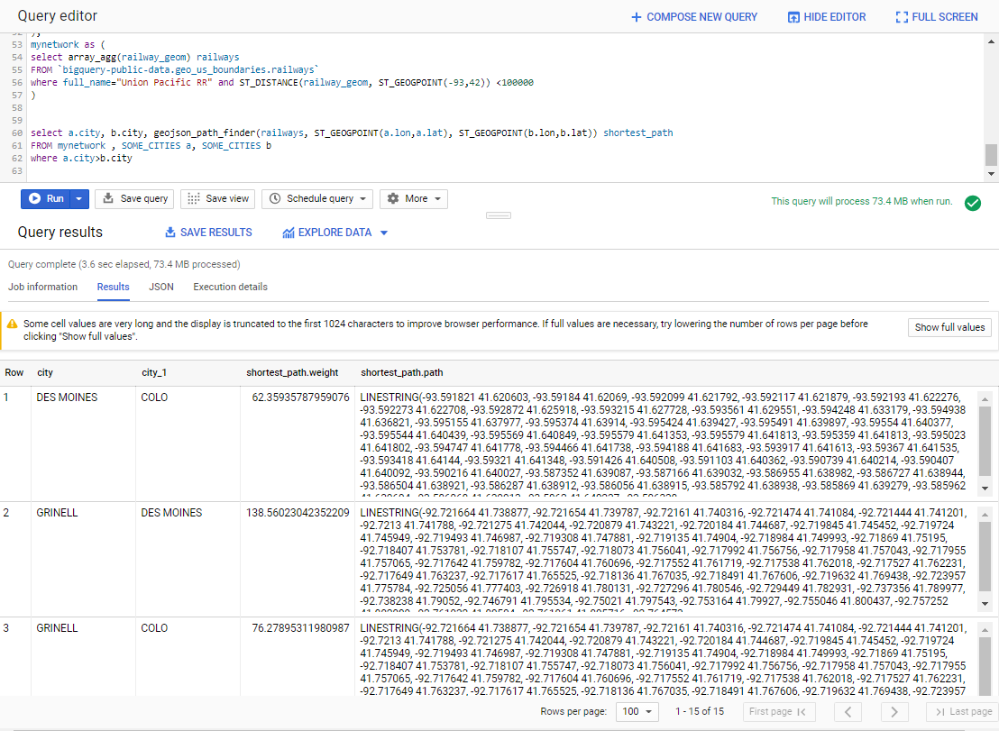

# Bigquery_shortest_path
Bigquery user-defined functions (UDFs) for pathfinding.
Find shortest path beetween to points through a network of Bigquery geography.

This project wraps [Per Liedman's GeoJSON Path Finder library](https://github.com/perliedman/geojson-path-finder/) to be run on Bigquery.

## Off-the-Shelf Demo
For this demo we use an webpack version of the [Per Liedman's GeoJSON Path Finder library with some tweaks](https://github.com/francois-baptiste/geojson-path-finder/blob/webpack/geojson_path_finder.js) that I host for you on publicly GCS at gs://bigquery-geolib/geojson_path_finder.js

We also use one of the few network available from BigQuery public dataset: `bigquery-public-data:geo_us_boundaries.railways`. Unfortunately, the network is discontinuous in several places, thus preventing significant routing planning.

Open a Bigquery console, copy, paste and run [this query](query.sql).

This query returns for each couple of cities the weight (the distance in this case) and the path of the shortest route through the rail network.

You can reproduce the path finding logic directly on your browser using the same JS library through the following demo page https://francois-baptiste.github.io/Bigquery_shortest_path/.
